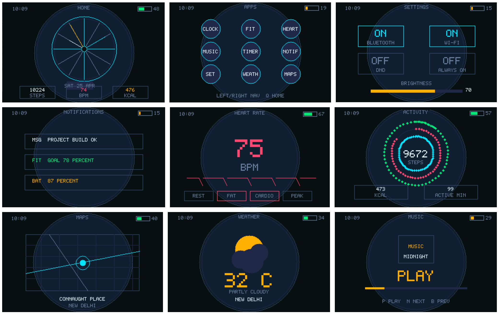

# AJXOS - Smartwatch OS in C and Assembly

> A bare-metal smartwatch OS prototype built with NASM, C, GCC and QEMU.  
> This is Phase 2 of AJXOS: moving from a Python OS simulation to a real bootable C/Assembly kernel.


---

## What Is This?

AJXOS started as a smartwatch OS simulator written in Python. The Python version focused on OS architecture: bootloader, HAL, kernel, scheduler, drivers, sensors, filesystem, power management, security, updates and smartwatch UI.

This folder is the C/Assembly rewrite.

Unlike the Python version, this one does not run through an interpreter. It boots as a raw disk image in QEMU:

```text
QEMU BIOS
   -> boot sector at 0x7C00
   -> NASM bootloader
   -> protected mode
   -> C kernel
   -> VGA graphics framebuffer
   -> smartwatch UI
```

The goal is to slowly port the Python architecture into industry-standard low-level languages: Assembly for boot, C for kernel/drivers, and QEMU for emulation.

---

## Current Screenshot

The current C kernel boots into a graphical watch face using VGA mode 13h.



---

## Architecture

```text
With C/
├── boot/
│   ├── boot.asm              # 16-bit bootloader: disk read, graphics mode, protected mode
│   └── kernel_entry.asm      # 32-bit entry point that calls kernel_main()
├── drivers/
│   ├── gfx.c                 # Pixel framebuffer graphics driver
│   ├── gfx.h                 # Graphics API and color constants
│   ├── vga.c                 # Older VGA text-mode driver
│   └── vga.h                 # Text-mode VGA API
├── kernel/
│   ├── kernel.c              # Watch backend, fake sensors, UI screens, input polling
│   └── kernel.h              # Kernel entry declaration
├── linker.ld                 # Kernel memory layout for flat binary output
├── build.ps1                 # Windows build/run script
└── README.md
```

---

## Boot Flow

```text
[1] BIOS loads boot sector at 0x7C00
[2] boot.asm sets up real-mode segments and stack
[3] boot.asm switches VGA into 320x200 graphics mode
[4] boot.asm reads kernel sectors from disk into 0x7E00
[5] boot.asm loads the GDT
[6] CPU switches to 32-bit protected mode
[7] kernel_entry.asm sets stack and calls kernel_main()
[8] kernel.c initializes palette, backend state and renderer
[9] AJXOS watch UI draws directly to framebuffer 0xA0000
```

---

## OS Concepts Implemented

| Concept | File | What it does |
|--------|------|-------------|
| Bootloader | `boot/boot.asm` | 512-byte boot sector, BIOS disk read, graphics mode, protected-mode switch |
| Kernel Entry | `boot/kernel_entry.asm` | 32-bit Assembly entry point, stack setup, calls C kernel |
| Linker Script | `linker.ld` | Places kernel code/data at `0x7E00` for flat binary boot |
| Graphics Driver | `drivers/gfx.c` | Direct pixel drawing into VGA framebuffer `0xA0000` |
| Palette Driver | `drivers/gfx.c` | Custom dark/cyan/amber AMOLED-like VGA palette |
| Kernel Loop | `kernel/kernel.c` | Poll input, update backend state, render current screen forever |
| Sensor Simulation | `kernel/kernel.c` | Fake steps, calories, BPM, battery and activity data |
| Input Polling | `kernel/kernel.c` | Reads PS/2 keyboard scancodes from ports `0x64` and `0x60` |
| Watch UI | `kernel/kernel.c` | Home, Activity, Heart, Apps, Settings, Music, Stopwatch, Weather, Maps |
| Serial Debug | `kernel/kernel.c` | Writes boot confirmation to COM1 serial log |

---

## Screens Implemented

| Screen | Status |
|--------|--------|
| Boot Screen | Implemented |
| Home / Clock Face | Implemented |
| Activity | Implemented |
| Heart Rate | Implemented |
| Notifications | Implemented |
| Quick Settings | Implemented |
| App Launcher | Implemented |
| Stopwatch | Implemented |
| Music | Implemented |
| Weather | Implemented |
| Maps | Implemented |

The C UI is still simpler than the Python UI, but it is now rendered by a real bare-metal kernel, not tkinter.

---

## Requirements

Install these tools and make sure they are available in your terminal PATH:

```text
NASM
GCC / MinGW-w64
GNU ld + objcopy
QEMU system i386
PowerShell
```

On Windows, this project was tested with:

```text
nasm.exe
gcc.exe
ld.exe
objcopy.exe
qemu-system-i386.exe
```

---

## Build

Open PowerShell in this folder:

```powershell
cd "C:\Users\sayed\Desktop\prsnl\WatchOS\With C"
```

Build the bootable image:

```powershell
powershell -ExecutionPolicy Bypass -File .\build.ps1
```

This generates:

```text
ajxos.img
```

The build script automatically:

1. Assembles the bootloader.
2. Assembles the kernel entry.
3. Compiles the freestanding C kernel.
4. Compiles graphics drivers.
5. Links the kernel using `linker.ld`.
6. Converts the kernel to a flat binary.
7. Calculates how many disk sectors the kernel needs.
8. Creates a padded 1.44MB floppy image for QEMU.

---

## Run

```powershell
powershell -ExecutionPolicy Bypass -File .\build.ps1 -Run
```

This launches QEMU and boots AJXOS from `ajxos.img`.

For headless serial verification:

```powershell
powershell -ExecutionPolicy Bypass -File .\build.ps1 -Run -Headless
```

If the kernel boots correctly, `serial.log` will contain:

```text
AJXOS: graphics watch kernel reached
```

---

## Controls

| Key | Action |
|-----|--------|
| `Left Arrow` | Previous screen |
| `Right Arrow` | Next screen |
| `C` | Open app launcher |
| `Q` | Go back to home |
| `S` | Stopwatch start/stop |
| `P` | Music play/pause |
| `N` | Next music track |
| `B` | Previous music track |
| `PgUp` | Increase brightness value |
| `PgDn` | Decrease brightness value |

---

## Python vs C Version

| Area | Python Version | C/Assembly Version |
|------|---------------|--------------------|
| Startup | `python main.py` | BIOS loads boot sector |
| Bootloader | Simulated in `boot.py` | Real NASM boot sector |
| Kernel | Python class | Freestanding C kernel |
| Display | tkinter canvas | VGA framebuffer at `0xA0000` |
| Input | tkinter events | PS/2 keyboard scancodes |
| Memory | Python runtime | Manual linker-controlled layout |
| Sensors | Simulated drivers | Simulated kernel state |
| UI | Rich 340x340 simulator | Early 320x200 bare-metal UI |
| Debugging | Python tracebacks | Serial logs + QEMU screenshots |

The Python version is more complete architecturally.  
The C version is lower-level and actually boots without Python underneath.

---

## Roadmap

- Add PIT timer interrupts instead of delay loops.
- Add a real IDT with IRQ handlers.
- Build a simple scheduler and process table.
- Move each watch app into separate C modules.
- Add syscall-style boundaries between kernel and apps.
- Port memory manager concepts from the Python version.
- Add a tiny virtual filesystem.
- Port power/security/update concepts from Python.
- Improve graphics beyond VGA mode 13h.
- Eventually target a more embedded-style platform.

---

## Why This Exists

The Python version helped answer:

> What does a smartwatch OS need architecturally?

The C/Assembly version answers:

> What does it take to make that OS actually boot?

Both are part of the same learning journey.

Python gave the map.  
C and Assembly reveal the machine.

---

## Author

**Ebad Sayed**  
[GitHub](https://github.com/ES7) · [Medium](https://medium.com/@sayedebad.777)

---

## License

MIT - see `LICENSE` for details.
